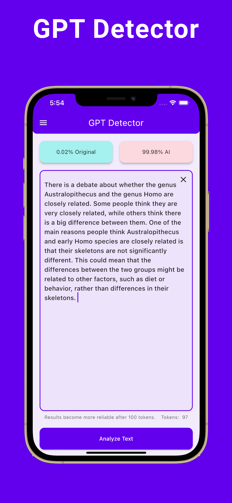
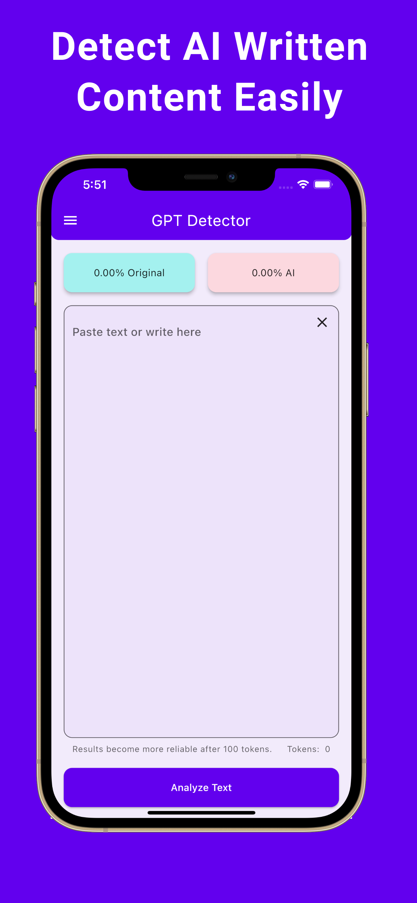

# GPT Detector

Uses the [GPT-2 Output Detector](https://github.com/openai/gpt-2-output-dataset/tree/master/detector) model to identify whether a text is written by a human or an AI.

## Built With

- [Flutter](https://flutter.dev/)
- [Dart](https://dart.dev/)

## Preview

<p align='center'>
    
    
    
</p>

## Architecture

This app is developed with [Clean Architecture](https://github.com/ResoCoder/flutter-tdd-clean-architecture-course#readme)

## How to run

This project contains generated files. First, you need to run the following command in the root folder of your project.

```sh
sh scripts/build_runner.sh
```

Then, follow this [link](https://github.com/openai/gpt-2-output-dataset/tree/master/detector#readme) to run your own model on your local machine.\
Then, create a file named '.env' in the 'env' folder located in the root folder of your project.\
Lastly, paste the following text into the '.env' file.

```sh
BASE_URL = 'http://localhost:8080'
```

## Privacy Policy

You can access the privacy policy by clicking [here](privacy-policy.md).

## License

Licensed under the MIT license, click [here](LICENSE.md) for details.
