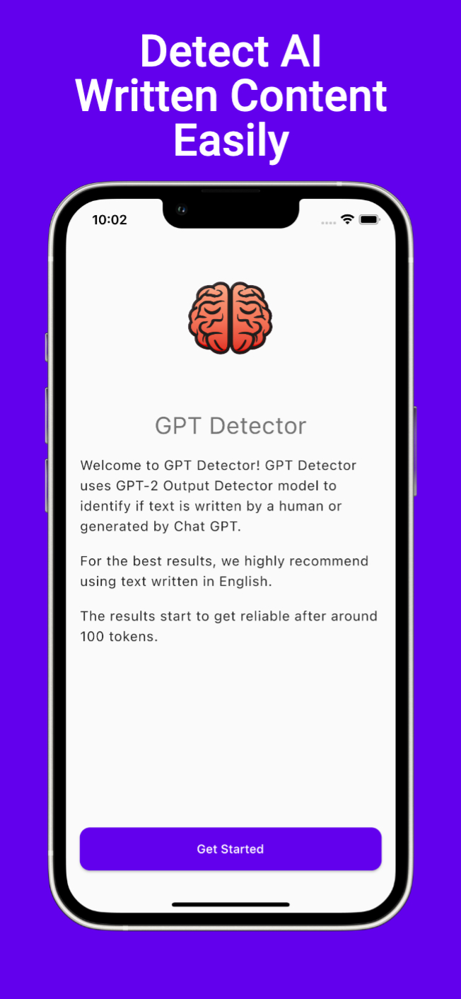
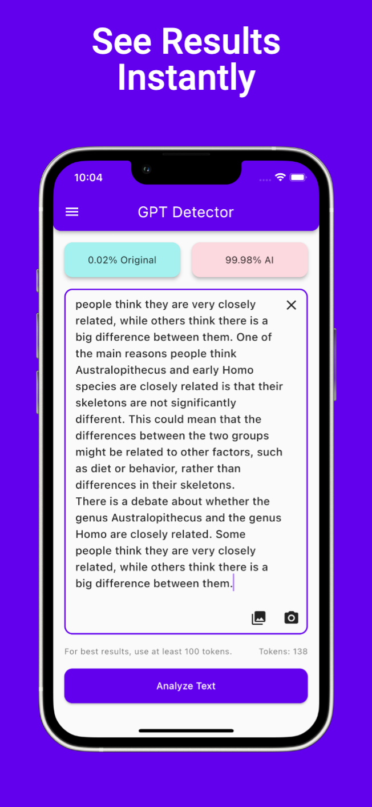
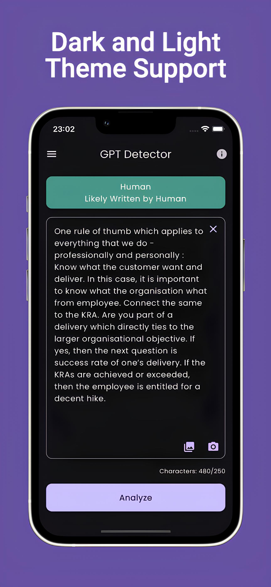
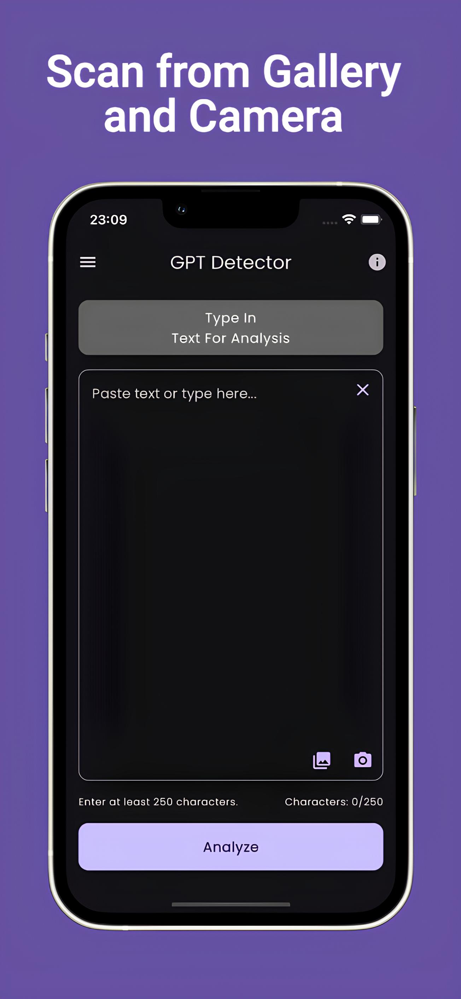

# GPT Detector

Predicts whether a text was written by a large language model such as ChatGPT or not.

## How results are calculated?

- Large language models like ChatGPT generate text that is typically less complex and random than human-created content. The level of randomness and complexity can be analyzed to differentiate between AI-generated and human-created content.

## What are the limitations of the GPT Detector?

- The current version of the GPT Detector is optimized for texts written in English. So, using text in other languages may result in inaccurate results.
- As AI models advance, they become better at generating text that resembles human writing, which affects the reliability of the GPT Detector. Therefore, relying solely on the detector's results for decision making is not recommended.

## Available on

## Built With

- [Flutter](https://flutter.dev/)
- [Dart](https://dart.dev/)

## Features

- Analyze text from plain text.
- Analyze text by selecting a photo from phone's gallery (OCR).
- Analyze text by using phone's camera (OCR).

## Architecture

Developed with [Clean Architecture](https://github.com/ResoCoder/flutter-tdd-clean-architecture-course#readme)

## Project Structure

- "core" folder contains application-agnostic code that can be reused in other projects.
- "feature" folder represents the app's feature set. Each feature is divided into subfolders for data, domain, and presentation.
- "app" folder holds files specific to this particular application.

## Preview

    
    
    
    

## Packages

- State Management
  - [Bloc](https://pub.dev/packages/flutter_bloc)
- Dart Data Class Generation
  - [Freezed](https://pub.dev/packages/freezed)
  - [JsonSerializable](https://pub.dev/packages/json_serializable)
- Functional Programming
  - [Dartz](https://pub.dev/packages/dartz)
- Network
  - [Dio](https://pub.dev/packages/dio)
  - [PrettyDioLogger](https://pub.dev/packages/pretty_dio_logger)
  - [InternetConnectionChecker](https://pub.dev/packages/internet_connection_checker)
- Dependency Injection
  - [GetIt](https://pub.dev/packages/get_it)
  - [Injectable](https://pub.dev/packages/injectable)
- Caching
  - [SharedPreferences](https://pub.dev/packages/shared_preferences)
- Linter
  - [VeryGoodAnalysis](https://pub.dev/packages/very_good_analysis)
- Animations
  - [FlutterAnimate](https://pub.dev/packages/flutter_animate)
- OCR
  - [GoogleMlKitTextRecognition](https://pub.dev/packages/google_mlkit_text_recognition)
- Testing
  - [Mocktail](https://pub.dev/packages/mocktail)
  - [BlocTest](https://pub.dev/packages/bloc_test)

## Privacy Policy

You can access the privacy policy by clicking [here](privacy-policy.md).

## License

Licensed under the MIT license, click [here](LICENSE.md) for details.
