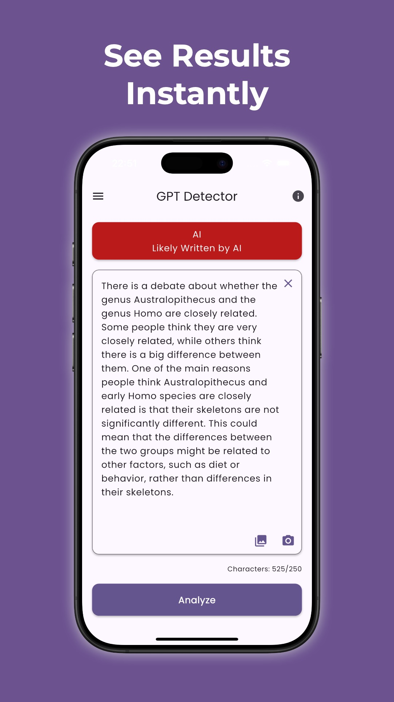

# GPT Detector

Calculates the perplexity and burstiness of a given text to determine whether it was generated by a large language model or not.

## Available on

## Preview

    
    
    
    

## Features

- Analyze plain text.
- Analyze text by selecting a photo from the photo library using OCR.
- Analyze text by utilizing the phone's camera with OCR.

## How results are calculated?

- Large language models like ChatGPT typically generate text that is less complex and random compared to human-created content. The level of randomness and complexity can be analyzed to differentiate between AI-generated and human-created content.

## What are the limitations of the GPT Detector?

- Current version of the GPT Detector is optimized for texts written in English. So, using text in other languages may result in inaccurate results.
- Texts written by children or non-native English speakers may be misclassified because they often produce text that is less random and complex.
- As AI models advance, they become better at generating text that looks like human writing which affects the reliability of the GPT Detector. Therefore, it's not advised to solely rely on the detector's results for decision-making.

## Architecture

Developed with [Clean Architecture](https://github.com/ResoCoder/flutter-tdd-clean-architecture-course#readme)

## Project Structure

- "core" folder contains application-agnostic code that can be reused in other projects.
- "feature" folder represents the app's feature set. Each feature is divided into subfolders for data, domain, and presentation.
- "app" folder holds files specific to this particular application.

## Packages

- State Management
  - [Bloc](https://pub.dev/packages/flutter_bloc)
- Dart Data Class Generation
  - [Freezed](https://pub.dev/packages/freezed)
  - [JsonSerializable](https://pub.dev/packages/json_serializable)
- Functional Programming
  - [Fpdart](https://pub.dev/packages/fpdart)
- Network
  - [Dio](https://pub.dev/packages/dio)
  - [PrettyDioLogger](https://pub.dev/packages/pretty_dio_logger)
  - [InternetConnectionChecker](https://pub.dev/packages/internet_connection_checker)
- Dependency Injection
  - [GetIt](https://pub.dev/packages/get_it)
  - [Injectable](https://pub.dev/packages/injectable)
- Caching
  - [SharedPreferences](https://pub.dev/packages/shared_preferences)
- Linter
  - [VeryGoodAnalysis](https://pub.dev/packages/very_good_analysis)
- Animations
  - [FlutterAnimate](https://pub.dev/packages/flutter_animate)
- OCR
  - [GoogleMlKitTextRecognition](https://pub.dev/packages/google_mlkit_text_recognition)
- Testing
  - [Mocktail](https://pub.dev/packages/mocktail)
  - [BlocTest](https://pub.dev/packages/bloc_test)
